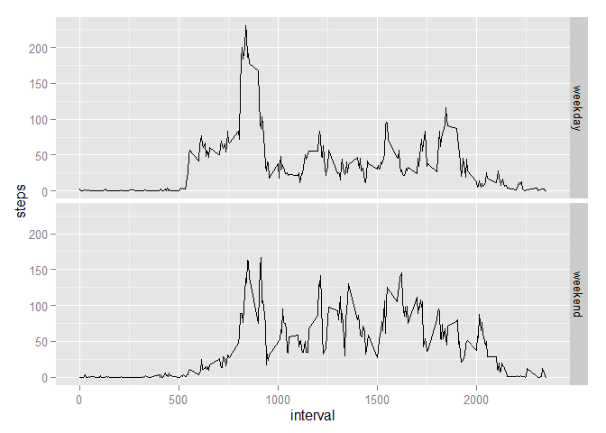

# Reproducible Research: Peer Assessment 1

This R Markdown file is my personal work for the Reproducible Research Course Project 1. It is based on the data from a personal activity monitoring device to perform subsequent analyses, as explained in the Course Project Introduction and the Readme.md file from the original Github template repository for this project.


## Part 1: Loading and preprocessing the data

We will first download dataset from the Internet and open it under R using read.csv() command.


```r
download.file(url="https://d396qusza40orc.cloudfront.net/repdata%2Fdata%2Factivity.zip",destfile="activity.zip") # I am using Windows, I don't need to specify method="curl"
unzip(zipfile="activity.zip")
data<-read.csv("activity.csv")
head(data)
```

```
##   steps       date interval
## 1    NA 2012-10-01        0
## 2    NA 2012-10-01        5
## 3    NA 2012-10-01       10
## 4    NA 2012-10-01       15
## 5    NA 2012-10-01       20
## 6    NA 2012-10-01       25
```

## Part 2: What is mean total number of steps taken per day?

I first subset the data to only take into account observations without missing values. Then I use reshape2 library to get a total number of steps for each day.


```r
subset<-data[!is.na(data$steps),]
library(reshape2)
melt<-melt(subset,id=c("date","interval"))
data2<-dcast(melt,date~variable,sum)
head(data2)
```

```
##         date steps
## 1 2012-10-02   126
## 2 2012-10-03 11352
## 3 2012-10-04 12116
## 4 2012-10-05 13294
## 5 2012-10-06 15420
## 6 2012-10-07 11015
```

I use the base plot system to make a histogram of the total number of steps taken each day.


```r
hist(data2$steps,breaks=20,col="grey",main="Total number of steps per day",xlab="Steps per day",ylab="Count (Days)")
```

 

We can quickly calculate the mean and median of the total number of steps taken per day using the following code:


```r
mean(data2$steps)
```

```
## [1] 10766.19
```

```r
median(data2$steps)
```

```
## [1] 10765
```

## Part 3: What is the average daily activity pattern?

I use again the reshape2 library to calculate an average number of steps for each 5-minute interval, averaged across all days. Then I make a time series plot using the base plot system, to get a sense of what is going on.


```r
data3<-dcast(melt,interval~variable,mean)
head(data3)
```

```
##   interval     steps
## 1        0 1.7169811
## 2        5 0.3396226
## 3       10 0.1320755
## 4       15 0.1509434
## 5       20 0.0754717
## 6       25 2.0943396
```

```r
plot(data3,type="l",xlab="5-minute interval",ylab="Number of steps",main="Average Daily Activity Pattern")
```

 


## Part 4: Imputing missing values

Using the original dataset, we can easily calculate the number of rows containing missing values.


```r
sum(is.na(data$steps))
```

```
## [1] 2304
```

I decided to fill the missing values using a simple strategy, i.e. using the average value corresponding to that specific 5-minute interval. For example, if a row contains a missing value and was recorded for the "105" interval, we can take the average number of steps calculated for the "105" interval.


```r
newData<-data.frame(data) # Creating a copy of the original dataset

# Filling missing values
for(i in 1:nrow(newData)){
    if(is.na(newData[i,1])){
        newData[i,1]<-data3$steps[data3$interval==newData[i,3]]
    }
}
head(newData,n=10)
```

```
##        steps       date interval
## 1  1.7169811 2012-10-01        0
## 2  0.3396226 2012-10-01        5
## 3  0.1320755 2012-10-01       10
## 4  0.1509434 2012-10-01       15
## 5  0.0754717 2012-10-01       20
## 6  2.0943396 2012-10-01       25
## 7  0.5283019 2012-10-01       30
## 8  0.8679245 2012-10-01       35
## 9  0.0000000 2012-10-01       40
## 10 1.4716981 2012-10-01       45
```

Based on this new dataset, we can create a new histogram giving the total number of steps taken each day.


```r
melt<-melt(newData,id=c("date","interval"))
newData2<-dcast(melt,date~variable,sum)
hist(newData2$steps,breaks=20,col="grey",main="Total number of steps per day",xlab="Steps per day",ylab="Count (Days)")
```

 

We then calculate new values for mean and median total number of steps per day.


```r
mean(newData2$steps)
```

```
## [1] 10766.19
```

```r
median(newData2$steps)
```

```
## [1] 10766.19
```

Interpretation: when having a closer look at the original dataset, we can notice that there are full "missing" days (here for example 2012-10-01 and 2012-10-08 are fully missing in the original dataset).  

Hence, when we are filling in missing values, we are really filling in the same average total number of steps per day again and again (i.e. 10766.19 steps in average).  


```r
head(data2,n=10)
```

```
##          date steps
## 1  2012-10-02   126
## 2  2012-10-03 11352
## 3  2012-10-04 12116
## 4  2012-10-05 13294
## 5  2012-10-06 15420
## 6  2012-10-07 11015
## 7  2012-10-09 12811
## 8  2012-10-10  9900
## 9  2012-10-11 10304
## 10 2012-10-12 17382
```

```r
head(newData2,n=10)
```

```
##          date    steps
## 1  2012-10-01 10766.19
## 2  2012-10-02   126.00
## 3  2012-10-03 11352.00
## 4  2012-10-04 12116.00
## 5  2012-10-05 13294.00
## 6  2012-10-06 15420.00
## 7  2012-10-07 11015.00
## 8  2012-10-08 10766.19
## 9  2012-10-09 12811.00
## 10 2012-10-10  9900.00
```

This explains why the average total number of steps per days remains unchanged, and why the median is moving towards this value (10766.19), because we are filling in this value over and over again in the new dataset.

## Part 5: Are there differences in activity patterns between weekdays and weekends?

Re-using the dataset with filled-in number of steps, we can create a new factor variable to indicate whether the current day is a weekday or not.  

My computer is in French, so "dimanche" means "Sunday" and "samedi" means "Saturday" to identify weekdays or weekends.


```r
newData$day<-weekdays(as.Date(newData$date))
for(i in 1:nrow(newData)){
    if(newData[i,4]=="dimanche"|newData[i,4]=="samedi"){
        newData[i,4]<-"weekend"
    }
    else{
        newData[i,4]<-"weekday"
    }
}
head(newData)
```

```
##       steps       date interval     day
## 1 1.7169811 2012-10-01        0 weekday
## 2 0.3396226 2012-10-01        5 weekday
## 3 0.1320755 2012-10-01       10 weekday
## 4 0.1509434 2012-10-01       15 weekday
## 5 0.0754717 2012-10-01       20 weekday
## 6 2.0943396 2012-10-01       25 weekday
```

We can use ggplot2 to quickly make a comparison between weekdays and weekends.


```r
melt<-melt(newData,id=c("date","interval","day"))
newData2<-dcast(melt,day+interval~variable,mean)

library(ggplot2)
g<-ggplot(newData2,aes(interval,steps))
g<-g+geom_line()
g<-g+facet_grid(day~.)
g
```

 
